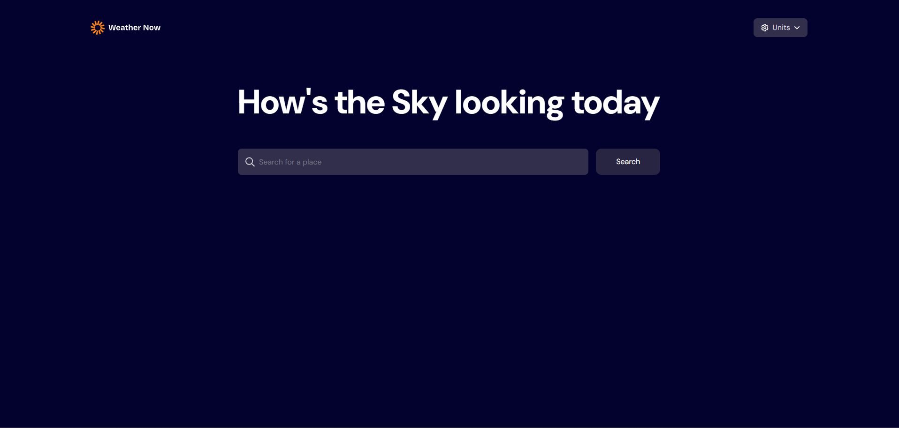
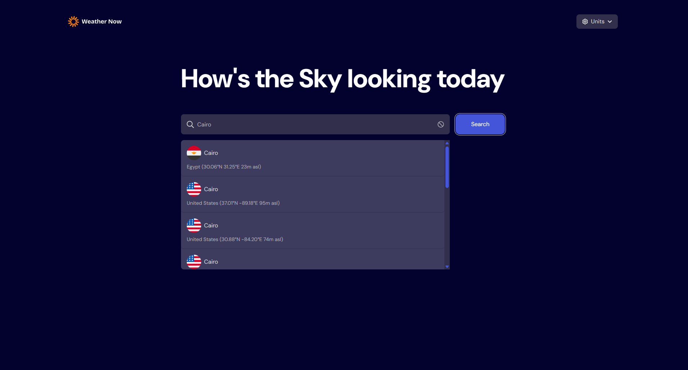
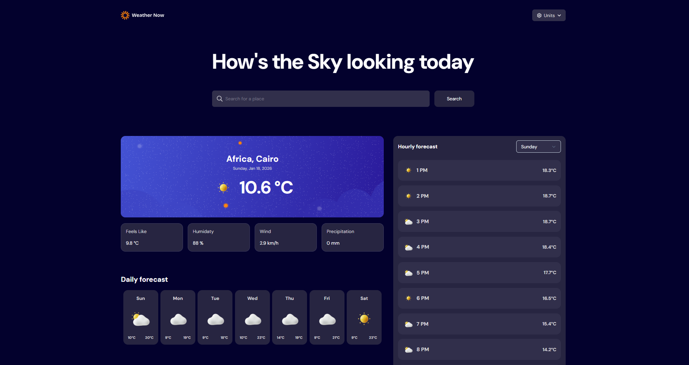
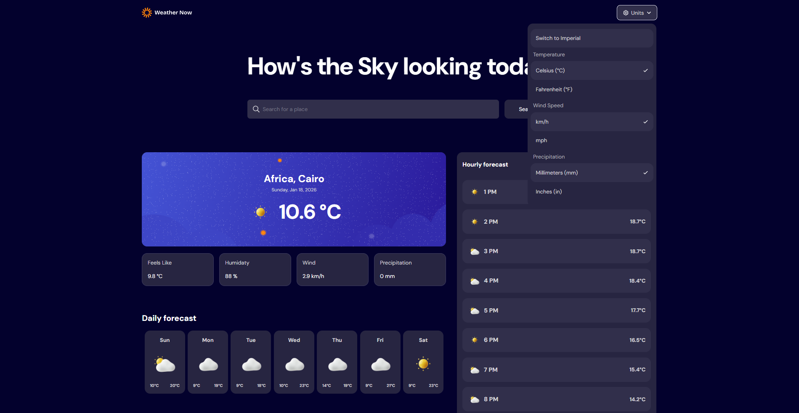
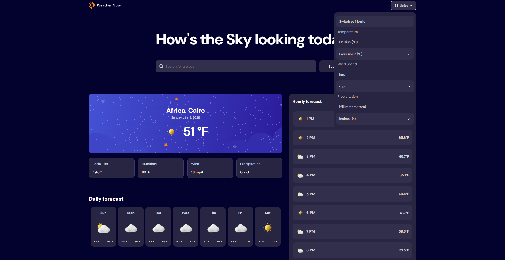

# Frontend Mentor - Weather app solution

This is a solution to the [Weather app challenge on Frontend Mentor](https://www.frontendmentor.io/challenges/weather-app-K1FhddVm49). Frontend Mentor challenges help you improve your coding skills by building realistic projects.

## Table of contents

- [Overview](#overview)
  - [The challenge](#the-challenge)
  - [Screenshot](#screenshot)
  - [Links](#links)
- [My process](#my-process)
  - [Built with](#built-with)
  - [What I learned](#what-i-learned)
- [Author](#author)

## Overview

### The challenge

Users should be able to:

- Search for weather information by entering a location in the search bar
- View current weather conditions including temperature, weather icon, and location details
- See additional weather metrics like "feels like" temperature, humidity percentage, wind speed, and precipitation amounts
- Browse a 7-day weather forecast with daily high/low temperatures and weather icons
- View an hourly forecast showing temperature changes throughout the day
- Switch between different days of the week using the day selector in the hourly forecast section
- Toggle between Imperial and Metric measurement units via the units dropdown
- Switch between specific temperature units (Celsius and Fahrenheit) and measurement units for wind speed (km/h and mph) and precipitation (millimeters) via the units dropdown
- View the optimal layout for the interface depending on their device's screen size
- See hover and focus states for all interactive elements on the page

### Screenshot

### Links

- Solution URL: [https://github.com/bassiony1/weather-app](https://github.com/bassiony1/weather-app)
- Live Site URL: [https://weather-app-alpha-six-89.vercel.app/](https://weather-app-alpha-six-89.vercel.app/)

## My process

### Built with

- Semantic HTML5 markup
- Tailwind CSS
- Mobile-first workflow
- [Redux toolkit]('http://redux-toolkit.js.org/') - State Management
- [React](https://reactjs.org/) - JS library

### What I learned

it was a fun project to play with redux toolkit for state management on a small project and tailwind customization

## Author

- Website - [Mahmoud Bassiony](https://bassiony1.github.io/portfolio/)
- Frontend Mentor - [@bassiony1](https://www.frontendmentor.io/profile/bassiony1)
- Twitter - [@bassiony17](https://www.twitter.com/bassiony17)
